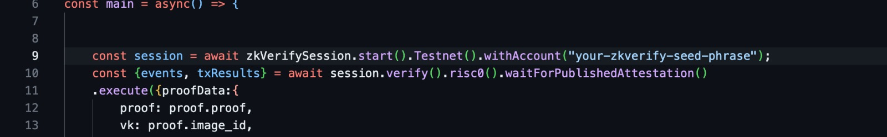

#### ZKVERIFY INCENTIVIZED TESTNET

1) Create account, add zkverify network and request faucet.
Here: https://docs.zkverify.io/tutorials/connect-a-wallet

####

2) Replace with your seed phrase.


```bash
nano index.js
Save file (Ctrl + X + Y + Enter)
```

####

3) Install and run script


```bash
chmod +x script.sh
npm install
npm install -g pm2
pm2 start ./script.sh
pm2 logs script
```


4) ##### HAPPY ZKVERIFICATION